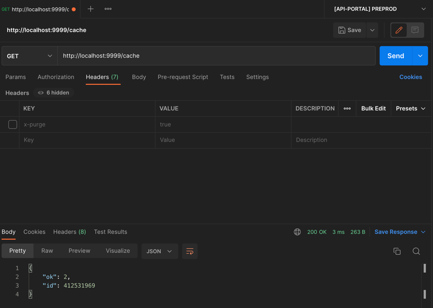
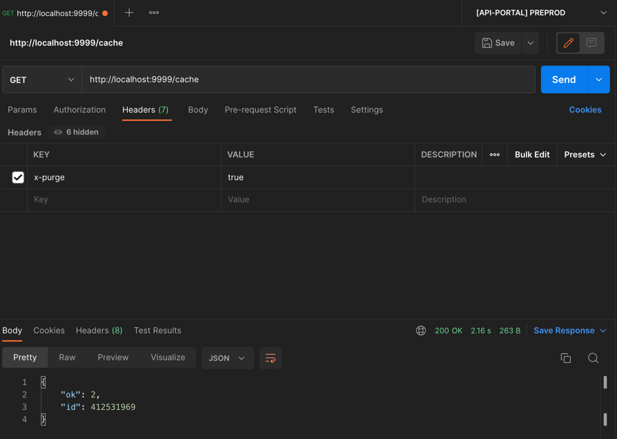

# Use NGINX to cache API Response

Here is the difference form cahced slow controller and not chached.

https://user-images.githubusercontent.com/44228481/193539029-1ceb06b0-9b33-4073-81a6-487231edb1c3.mov

Incredibles preformances on local machine.

## Nginx 

The hearth of nginx cache is in this [file](.build/server.config) :
```
fastcgi_cache_path  /var/cache/nginx/api  levels=1:2  keys_zone=apicache:60m;
fastcgi_cache_key   $scheme://$host$saved_uri$is_args$args;  # we must use the query string too, because it identifies the apicache

server {
    listen 80;
    server_tokens off;
    client_max_body_size 20M;

    server_name _;
    access_log off;

    root /app/public;

    include fastcgi_params;  # putting this ahead, to let locations override the params


    location / {
        set $saved_uri $uri;  # NOTE we need this because the $uri is renamed later to "index.php", so we loose the "original" one
        try_files /dev/null @rewriteapp;
    }

    location ~ ^/(ping|health)$ {
        rewrite ^(.*)$ /index.php/$1 last;
    }

    location @rewriteapp {
        rewrite ^(.*)$ /index.php/$1 last;
    }

    location ~ ^/(index)\.php(/|$) {
        include fastcgi_params;  # putting this ahead, to let locations override the params

        fastcgi_cache_bypass        $http_x_purge;
        fastcgi_cache apicache;  # for fastcgi do not use proxy_cache
        fastcgi_cache_methods GET;

        fastcgi_param REQUEST_URI $saved_uri;  ## IMPORTANT By default fastcgi_params, it takes $request_uri (generating infinte loop because of ssi inclusion)
        fastcgi_param QUERY_STRING $args; ## query params
        fastcgi_pass php-fpm:9000;
        fastcgi_split_path_info ^(.+\.php)(/.*)$;

        fastcgi_param SCRIPT_FILENAME $document_root$fastcgi_script_name;
        fastcgi_param DOCUMENT_ROOT $document_root;
        fastcgi_param REQUEST_METHOD  $request_method;
        fastcgi_param CONTENT_TYPE    $content_type;
        fastcgi_param CONTENT_LENGTH  $content_length;
        fastcgi_read_timeout 300;
        internal;
    }
}
```

We use the cache only for *GET* requests, so please use the correct API-REST convention.

We save the URL before send it to fast-cgi and we use it as key.

We send some more helpful headers to backend.

Cache params :
* path : /var/cache/nginx/api  
* levels=1:2 : we use folder structure to create efficent file access
* keys_zone=apicache:60m : name of cache `apicache` and ttl of 60min 


### PURGE

if you have a client that should have the must recent information (for example admin panel that modify some data),
you can use this header client side to not use the cache :

`x-purge: true`

for example :

This curl continue cache the response (3ms response):

```curl
curl --location --request GET 'http://localhost:9999/cache'
```

and this one not use the cache (2.18s response, 180ms of symfony):

```curl
curl --location --request GET 'http://localhost:9999/cache' \
--header 'x-purge: true'
```

With the last one we have the more recent data and also cache the last one.


## PHP

The only thing you have to do is set this attribute in your code : 

```php
#[HttpCacheable(maxAge: 3600)]
```

If you don't set the maxAge a default value of 3600s is taken. Set more the 1H is not necessary, nginx will revalidate 
the cache in any case.

There is a `ResponseEventHandler` that intercept the response and add cache header if necessary.

On client side you can see if a response *can be* a cached response analyzing the headers : if exists this one `X-Webserver-Cache` the 
response could be cached.

If you sand the header `x-purge: true` you still see the `X-Webserver-Cache` but it is a fresh response (cached for the next call).  


